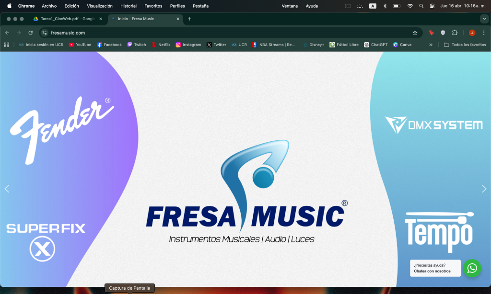

# Clon de Fresa Music

Este es un proyecto básico donde cloné la interfaz principal de **Fresa Music** usando HTML y CSS puro (sin frameworks).

## Vista del Proyecto

## Lo que hice:
- Estructura semántica con HTML5.
- Diseño personalizado con CSS3 y variables.
- Barra de navegación oscura con buscador y carrito.
- Banner principal (Hero) con la imagen de marca.
- Botón flotante de WhatsApp.
- Comentarios en el código para entender todo mi proceso.

## Cómo verlo:
Solo abre el archivo `index.html` en cualquier navegador.
